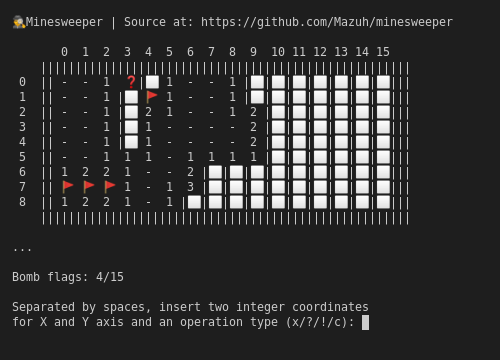
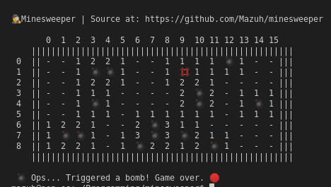

# Minesweeper

Find mines in your dark terminal.

Powered by emojis. 😉

## Screenshots and instructions for playing

You can touch the field using input coordinates like `1 4 x`, for example.
And replace the `x` by the `!` and `?` flags (or removing the
flag with `c`).

Touching will either trigger a bomb (that kills you) or reveal the surroundings.
Revealed numbers indicates how many bombs are nearby that cell.

You win the game by marking with the flag `!` all the mines (and only them, nothing else).
The question mark may be used as a visual support, not affecting the game at all.





## Setting up

Having `g++` with C++ 17 support, just run this inside the cloned repository:

```sh
make
```

## Customize game

You can choose the number of rows and columns on the board and the number of mines.

For this, use the columns, rows and mines optional variables when run make:

```sh
make columns=10 rows=4 mines=8
```

That's it. Compiled using my Pop!_OS. I have no idea of how to run it in other environments.

## Disclaimer

I don't even really know C++, this was created cause I was bored during COVID-19 quarantine.
